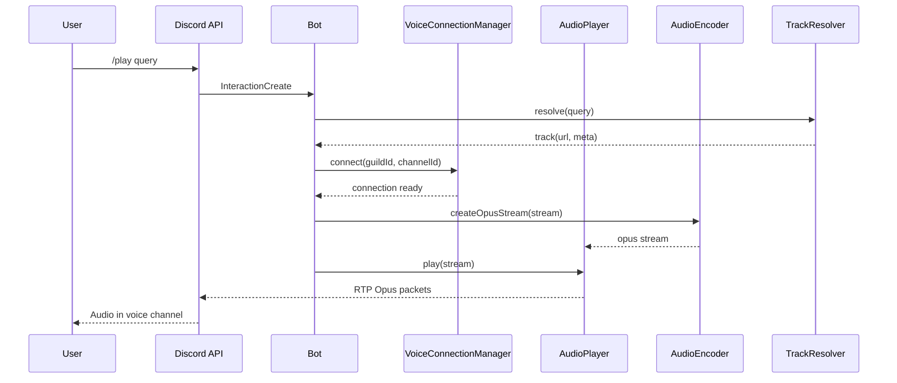
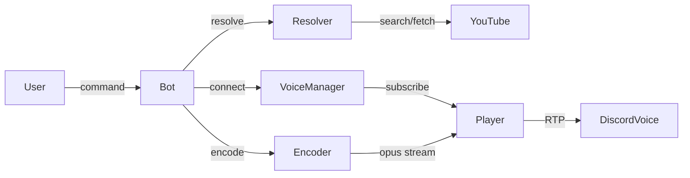

# System Architecture & Flow

## Components
- Command Layer: dispatches slash commands to handlers
- Native Path: VoiceConnectionManager + AudioPlayerWrapper + AudioEncoder + TrackResolver -> Discord VC
- External Services: YouTube (play-dl/yt-dlp), Spotify metadata (spotify-url-info)

## Architecture Diagram
```mermaid
flowchart TD
  U[User] -->|/play| G[Gateway/discord.js]
  G --> CMD[Command Handler]
  CMD --> RES[TrackResolver]
  RES --> YT[YouTube (play-dl/yt-dlp)]
  RES --> SP[Spotify (spotify-url-info)]
  CMD --> VCX[VoiceConnectionManager]
  VCX --> SUB[AudioPlayerWrapper.subscribe]
  CMD --> ENC[AudioEncoder (FFmpeg -> Opus)]
  ENC --> SUB
  SUB -->|Opus RTP| VC[Discord Voice]
```

## Sequence — Play via Native Path


## Data Flow Diagram

