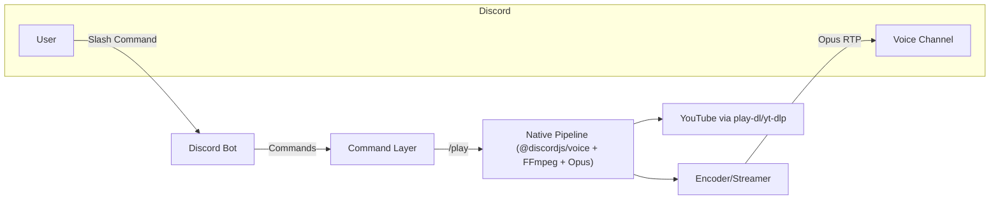

# Radio Raccoon — High-Level Overview

## Purpose
A Discord music bot with a single native playback path:
- Native encoder pipeline powered by @discordjs/voice + prism-media + FFmpeg

## Key Features
- Play from YouTube (URL or search)
- Queue management (play/queue/pause/resume/skip/stop/clear)
- YouTube playlists
- Spotify tracks/playlists (tokenless metadata → YouTube search)

## Target Users
- Personal/small community Discord servers (1–3 concurrent guilds)

## Current Status
- Native path: stable MVP via `/play`; queue controls implemented

## Tech Stack & Tools
- Language: Node.js (v20)
- Discord: discord.js v14, @discordjs/voice
- Audio: prism-media, FFmpeg, Opus encoding
- Sources: play-dl + yt-dlp (fallback), spotify-url-info (no credentials)
- Hosting: local dev, Docker, VPS (DigitalOcean recommended)

## High-Level Block Diagram

